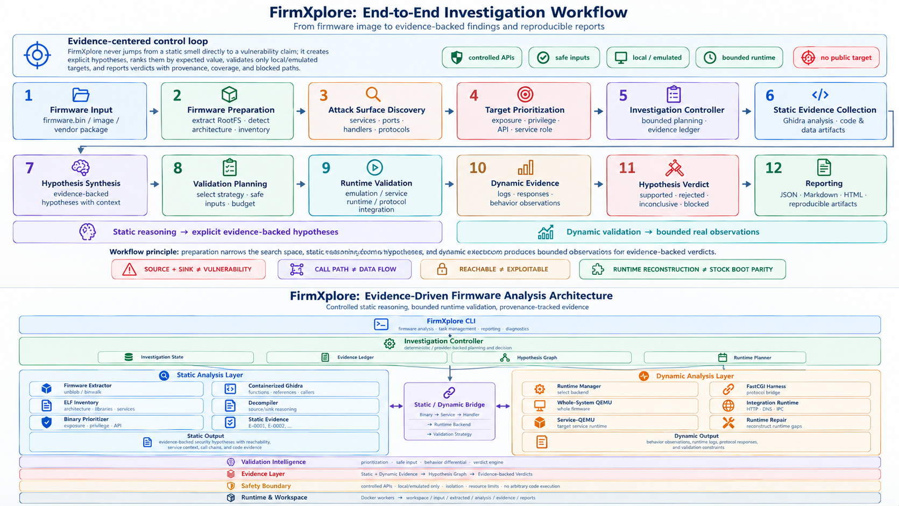
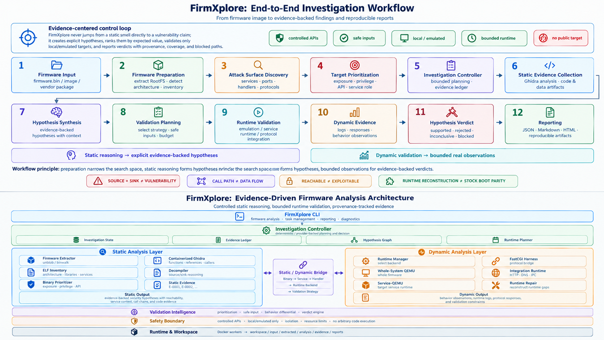

# FirmXplore

[](https://www.python.org/)
[](https://www.docker.com/)
[](pyproject.toml)
[](#)
[](#reports)

**An LLM-Driven System for Firmware Security Analysis.**

FirmXplore is an automated evidence-driven firmware security analysis agent. It combines firmware extraction, canonical root filesystem validation, real headless binary analysis, cross-component evidence correlation, bounded runtime validation, and provider-backed investigation under deterministic safety and budget controls.

FirmXplore does not generate exploits, does not probe public targets, and does not manufacture vulnerability findings when evidence is insufficient.

## 🧭 Overview

FirmXplore turns a firmware image into a reproducible analysis workspace while keeping static reasoning, runtime observations, and final claims explicitly separated.

<p align="center">
  
</p>

<p align="center">
  <sub><b>Figure 1.</b> FirmXplore evidence-driven firmware analysis architecture.</sub>
</p>

Provider-backed investigation is a planning and decision layer. The provider sees registered structured tools through FirmXplore's controller; it does not receive arbitrary shell, Docker, QEMU, or process-execution tools.

## ✨ Key Features

- Firmware extraction with Docker/binwalk-backed root filesystem recovery, archive-contained firmware fallback, and legacy LZMA SquashFS recovery via `sasquatch`.
- Canonical RootFS validation, ELF inventory, architecture detection, and task workspace management.
- Binary prioritization for high-value static targets.
- Containerized Ghidra analysis with generated function/import/export artifacts.
- Component graph construction and attack-surface modeling.
- Generic static attack-surface discovery from init scripts, service configurations, web route layouts, and Ghidra evidence — independent of any specific service backend.
- Evidence-backed source/sink correlation for security-relevant context, with static fallback when runtime-derived sources are unavailable.
- Deterministic hypothesis synthesis, validation prioritization, and bounded investigation loops.
- Safe runtime reconstruction for selected service/application validation paths.
- FastCGI/service validation with provenance-tracked DynamicEvidence records.
- Provider-backed investigation with structured output and controlled tool calling.
- Provider failure handling with retry, exponential backoff, and degraded-mode fallback.
- Token usage tracking for every provider HTTP call.
- JSON, Markdown, and local/offline HTML reports.
- Resume, status, cleanup, and explicit report-regeneration commands.

## 🔄 Analysis Workflow

FirmXplore follows an evidence-centered investigation workflow. Firmware preparation narrows the search space, static analysis produces explicit evidence-backed hypotheses, and bounded dynamic validation collects real observations before a hypothesis can influence a final finding.

<p align="center">
  
</p>

<p align="center">
  <sub><b>Figure 2.</b> FirmXplore end-to-end investigation workflow.</sub>
</p>

The workflow is intentionally conservative: reachability is not treated as exploitability, a source and sink do not automatically establish data flow, and runtime reconstruction is not presented as proof of stock vendor boot parity.

## 🚀 Quick Start

### 📦 Requirements

- Python 3.10 or newer.
- Docker Engine-compatible runtime.
- Tested environment: Windows 10/11 with Docker Desktop.
- Host Ghidra is not required for the default containerized deep-static backend.
- Host Java 21 is not required for the default containerized deep-static backend.

### 🛠️ Installation

FirmXplore is not documented here as a PyPI package. Install from the repository:

```bash
git clone https://github.com/Falcons-Lab/FirmXplore.git
cd FirmXplore
python -m pip install -e .
```

The user-facing console command is `firmxplore`. The Python package name remains `fwagent` internally for compatibility; future releases will migrate to `firmxplore` as the public import path.

### 🔍 Analyze Firmware

```bash
firmxplore analyze firmware.bin
```

By default, FirmXplore creates a task under `workspace/` and generates reports under `workspace/<task-id>/reports/`.

Advanced example:

```bash
firmxplore analyze firmware.bin --workspace workspace --task-id my-analysis --timeout 1200 --report-format json,md,html
```

### 📊 Status and Reports

```bash
firmxplore status my-analysis --workspace workspace
firmxplore report my-analysis --workspace workspace --format json,md,html
```

Developer fallback:

```bash
python -m fwagent.cli analyze firmware.bin --workspace workspace --task-id my-analysis
```

### 🎛️ Analysis Modes

FirmXplore supports two analysis scopes:

**Deterministic static analysis (default):**

```bash
firmxplore analyze firmware.bin
```

Runs extraction, RootFS inventory, Ghidra analysis, component correlation, attack-surface discovery, taint correlation, hypothesis synthesis, and report generation. No dynamic validation.

**Static + provider-backed investigation:**

```bash
firmxplore analyze firmware.bin --provider-backed
```

Adds a bounded LLM investigation loop (PiAgent) on top of the deterministic pipeline. The provider receives structured tools only; no shell, Docker, or process-execution access.

**Explicitly disabling dynamic validation:**

```bash
firmxplore analyze firmware.bin --no-dynamic
```

Skips `INVESTIGATION` and `DYNAMIC_VALIDATION` stages. Use this when the target architecture is not emulatable or when you want a fast static-only run. The report marks these stages as `skipped_by_user`, distinct from pipeline failures.

## 🤖 Provider-Backed Investigation

Provider integration is optional. Deterministic analysis can run without provider credentials; provider-backed commands require a configured model API.

FirmXplore reads provider configuration from environment variables or a local `.env` file. Required variable names:

```text
MODEL_PROVIDER
MODEL_NAME
MODEL_API_KEY
MODEL_BASE_URL
```

Compatibility aliases are also supported:

```text
FWAGENT_MODEL_PROVIDER
FWAGENT_MODEL_NAME
FWAGENT_MODEL_API_KEY
FWAGENT_MODEL_BASE_URL
```

`.env` is ignored by Git and Docker builds. Do not put API keys in reports, prompts, commits, or issue text.

Example `.env`:

```text
MODEL_PROVIDER=openai-compatible
MODEL_NAME=gpt-4o-mini
MODEL_API_KEY=sk-xxxxxxxxxxxxxxxx
MODEL_BASE_URL=https://api.openai.com/v1
```

Provider diagnostics:

```bash
firmxplore model-doctor --connect
firmxplore model-smoke
```

Provider-backed validation smoke:

```bash
firmxplore agent-smoke my-analysis H-PROVIDER-SMOKE --workspace workspace
```

Provider-backed investigation on a real task:

```bash
firmxplore analyze firmware.bin --provider-backed
```

Current v0.1 provider acceptance validates **bounded provider-backed execution**. The accepted smoke run terminated at the configured controller step budget (`max_steps`), not through an autonomous convergence decision.

### 🔻 Provider Failures and Degraded Mode

The provider-backed investigation loop is bounded and fault-tolerant:

- **Transient API errors** (connection reset, timeout, HTTP 5xx) trigger exponential-backoff retries.
- **Persistent API errors** stop the loop with `stop_reason=model_error` and preserve all evidence, hypotheses, and tool calls collected up to that point.
- **Missing Ghidra** in the environment causes the loop to enter **degraded mode**: it runs with string/symbol-level tools only and marks `model_investigation.degraded=true`.

Degraded and interrupted investigations are **non-canonical** in Round-5 finalization. Their outputs appear under `report.model_hypotheses` and `report.model_evidence`, clearly labeled `canonical=false`.

### 💰 Model Usage and Cost Tracking

Every provider HTTP call is logged to:

```text
workspace/<task-id>/web_model_usage.jsonl
```

Each record contains `ts`, `model`, `endpoint`, `prompt_tokens`, `completion_tokens`, `total_tokens`, and `status`. This file is the authoritative source for token accounting and cost auditing. The Web console surfaces the same data in the task detail view.

## 🛡️ Safety and Evidence Model

FirmXplore is intentionally conservative:

- Analyze local and authorized firmware only.
- Do not probe public targets.
- Do not expose arbitrary shell, Docker, QEMU, or process execution to the provider.
- Do not generate exploit payloads.
- Keep dynamic validation bounded by request, tool-call, runtime, and loopback controls.
- Track evidence provenance and runtime-observation status.
- Exclude mock, simulated, blocked, and inconclusive attempts from canonical real-runtime confirmation.

Interpretation rules:

- `SOURCE + SINK != VULNERABILITY`
- `CALL PATH != DATA FLOW`
- `REACHABLE != EXPLOITABLE`
- `HTTP 500 != VULNERABILITY`
- `RUNTIME RECONSTRUCTION != STOCK BOOT PARITY`

## 📄 Reports

Each analysis task can generate:

| **Artifact**                 | **Path**                                                  |
| :--------------------------- | :-------------------------------------------------------- |
| JSON report                  | `workspace/<task-id>/reports/report.json`                 |
| Markdown report              | `workspace/<task-id>/reports/report.md`                   |
| HTML report                  | `workspace/<task-id>/reports/report.html`                 |
| Report manifest              | `workspace/<task-id>/reports/report_manifest.json`        |
| Pipeline summary             | `workspace/<task-id>/pipeline_summary.json`               |
| Pipeline stages              | `workspace/<task-id>/pipeline_stages.json`                |
| Extraction record            | `workspace/<task-id>/artifacts/extraction.json`           |
| Canonical rootfs record      | `workspace/<task-id>/artifacts/rootfs.json`               |
| Ghidra summary               | `workspace/<task-id>/ghidra/analysis_summary.json`        |
| Attack surface               | `workspace/<task-id>/surface/attack_surface_summary.json` |
| Taint summary                | `workspace/<task-id>/taint/summary.json`                  |
| Hypotheses                   | `workspace/<task-id>/hypotheses/synthesis_analysis.json`  |
| Provider investigation trace | `workspace/<task-id>/reports/investigation.json`          |
| Provider token usage         | `workspace/<task-id>/web_model_usage.jsonl`               |
| Dynamic evidence             | `workspace/<task-id>/dynamic/evidence/evidence.json`      |
| Findings                     | `workspace/<task-id>/findings/findings.json`              |

The HTML report is a local/offline artifact, not a Web UI.

## ✅ Validated Examples

### Example 1: TP-Link SR20 (ARM, real dynamic + provider)

```text
tpra_sr20v1_us-up-ver1-2-1-P522_20180518-rel77140_2018-05-21_08.42.04.bin
```

| **Metric**                | **Result**                   |
| :------------------------ | :--------------------------- |
| Extraction backend        | Docker/binwalk               |
| RootFS files              | 2255                         |
| ELF binaries              | 457                          |
| Architecture              | ARM 32-bit little-endian     |
| Real Dockerized Ghidra    | 20 / 20                      |
| Ghidra fallback           | 0                            |
| Runtime path              | Selected FastCGI integration |
| Real runtime observations | 4                            |
| Findings                  | 0                            |

The selected FastCGI validation reached the application and observed an HTTP 500 SOAP fault for an unknown SOAP action. That response is application behavior for the safe probe and is not a vulnerability claim. FirmXplore treats `Findings: 0` as **no vulnerability promoted from canonical evidence**, not as a failed run.

### Example 2: TP-Link TEW-751DR (MIPS big-endian, static + provider, no-dynamic)

```text
TEW751DR_FW103B03.bin
```

| **Metric**             | **Result**               |
| :--------------------- | :----------------------- |
| Extraction backend     | Docker/binwalk           |
| RootFS files           | 1527                     |
| ELF binaries           | 121                      |
| Architecture           | MIPS big-endian          |
| Real Dockerized Ghidra | 12 / 12                  |
| Attack surface entries | 27                       |
| Taint sources          | 27                       |
| Taint sinks            | 56                       |
| Candidate findings     | 14                       |
| Runtime validation     | skipped (`--no-dynamic`) |

All 14 findings are `status=candidate` with confidence 0.35–0.42, each associated with an explicit `missing_evidence` list (argument mapping, runtime sink observation, sanitizer behavior, argument-level source-to-sink mapping). FirmXplore does not promote candidates to canonical findings without runtime or argument-level evidence.

## 🧪 v0.1 Acceptance Status

Current status:

`FIRMXPLORE V0.1 REAL DYNAMIC + REAL PROVIDER ACCEPTED / MULTI-FIRMWARE ACCEPTANCE PARTIAL`

| **Capability**                                     | **Status** |
| :------------------------------------------------- | :--------- |
| Fresh extraction                                   | PASS       |
| Canonical RootFS                                   | PASS       |
| Real Dockerized Ghidra                             | PASS       |
| Cross-component correlation                        | PASS       |
| Static attack-surface discovery                    | PASS       |
| Taint source discovery                             | PASS       |
| Safe real dynamic runtime                          | PASS       |
| Canonical runtime evidence                         | PASS       |
| Provider-backed Agent                              | PASS       |
| Provider degraded mode                             | PASS       |
| Structured output                                  | PASS       |
| Controlled tool calling                            | PASS       |
| Token usage tracking                               | PASS       |
| ARM real firmware                                  | PASS       |
| MIPS architecture fixture                          | PASS       |
| MIPS real firmware (static)                        | PASS       |
| Unsupported input handling                         | PASS       |
| Additional real firmware extraction/static reports | PARTIAL    |
| Multi-firmware real acceptance                     | PARTIAL    |

Release candidate compatibility validation remains pending for full real Ghidra and runtime/provider acceptance across a second distinct authorized real firmware image. FirmXplore v0.1 is therefore not documented as RC-ready.

## 🧩 Validated Samples

| **Sample Class**                | **Status**    | **Notes**                                                                                                                          |
| :------------------------------ | :------------ | :--------------------------------------------------------------------------------------------------------------------------------- |
| TP-Link SR20 real firmware      | PASS          | Real extraction, Ghidra, selected dynamic runtime, provider acceptance                                                             |
| TP-Link TEW-751DR real firmware | PASS (static) | MIPS big-endian, real Ghidra, static attack surface, candidate findings, `--no-dynamic`                                            |
| D-Link DIR-815 real firmware    | PARTIAL       | Legacy SquashFS/LZMA extraction via `sasquatch`, MIPS little-endian inventory and reports; real Ghidra/runtime validation partial  |
| Huawei HG532e real firmware     | PARTIAL       | Big-endian SquashFS/LZMA extraction via `sasquatch`, MIPS big-endian inventory and reports; real Ghidra/runtime validation partial |
| MIPS architecture fixture       | PASS          | Fixture integration coverage only                                                                                                  |
| Opaque unsupported sample       | PASS          | Graceful partial handling, no crash                                                                                                |

## ⚠️ Known Limitations

1. Full real dynamic/provider acceptance currently includes a limited number of distinct real firmware images; additional real firmware images have extraction/static reports only.
2. Dynamic validation has been demonstrated on the selected FastCGI path, not every firmware service.
3. Runtime repair establishes reconstructed reachability, not original vendor boot-sequence parity.
4. Source/sink correlation is evidence-oriented and does not imply vulnerability confirmation.
5. Provider-backed execution is bounded by deterministic controller budgets.
6. Whole-firmware emulation is not guaranteed for every image.
7. Static attack-surface discovery currently covers init scripts, service configurations, web route layouts, and Ghidra-imported network calls; firmware-specific service managers may require additional heuristics.

## 🧰 Development and Testing

Run the full test suite:

```bash
python -m unittest discover -v
```

Environment-gated real dynamic/provider acceptance tests are available for configured local workspaces:

```powershell
$env:FIRMXPLORE_RUN_REAL_DYNAMIC_TESTS='1'
$env:FIRMXPLORE_RUN_REAL_PROVIDER_TESTS='1'
python -m unittest tests.integration.test_v01_real_dynamic_provider_acceptance -v
```

Build the default containerized Ghidra/extraction worker:

```bash
docker build -t firmxplore:latest .
```

The container includes `binwalk`, `unblob`, `unsquashfs`, and `sasquatch` so legacy SquashFS 3.x/4.x LZMA firmware images can be recovered by the default Docker extraction path. Archive wrappers such as vendor ZIP releases are unpacked first, then embedded firmware images are retried through the Docker extraction path when the wrapper itself has no Linux rootfs.

`firmxplore:latest` and `firmxplore-dynamic:latest` are internal implementation image names retained for reproducibility metadata; FirmXplore is the product name.

## 📁 Project Layout

```text
FirmXplore/
  assets/
    architecture.png
    workflow.png
    Falcons.png
    CTRA.png
  fwagent/        # Internal Python package
  config/         # Ghidra and dynamic validation configuration
  ghidra_scripts/ # Containerized Ghidra export helpers
  tests/          # Unit and integration tests
  workspace/      # Generated task workspaces, ignored by Git
  reports/        # Local generated reports, ignored by Git
```

## 🤝 Team & Support

<p align="left">
  
  <strong style="margin-left: 8px;">Falcons Lab</strong>
  
  <strong style="margin-left: 8px;">CTRA@DGSSZ</strong>
</p>

<table>
  <tr>
    <td align="center" width="90">
      <a href="https://github.com/zer0ptr">
        
      </a><br/>
      <a href="mailto:iszhenghailin@gmail.com"><sub><b>Hailin Zheng</b></sub></a>
    </td>
    <td align="center" width="90">
      <a href="https://github.com/colorfulbird3">
        
      </a><br/>
      <a href="mailto:a1396228851@outlook.com"><sub><b>Qingyi Huang</b></sub></a>
    </td>
    <td align="center" width="90">
      <a href="https://github.com/Fa2maZ">
        
      </a><br/>
      <sub><b>Guandong Li</b></sub>
    </td>
  </tr>
</table>

## 📜 License

This project is configured as MIT in `pyproject.toml`.